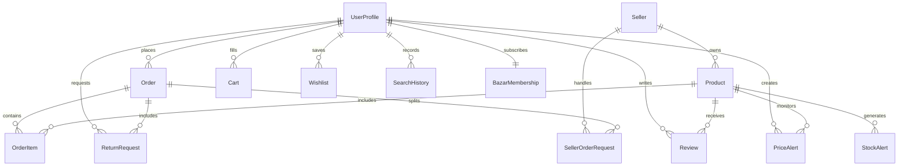

# 🛒 OnlineBazar E-Commerce Web Application
### MCA Academic Project — Django + PostgreSQL + Machine Learning

---

## 👨‍💻 Developed By

| Name          | Roll Number | Programme |
|---------------|-------------|-----------|
| Ankit Sharma  | 34          | MCA       |
| Niraj Kumar   | 8           | MCA       |

---

## 🚀 Overview

OnlineBazar is a production-ready Django ecommerce platform built for a multi-role marketplace. It includes:
- Buyer shopping, cart, checkout, order tracking, reviews.
- Seller catalog, order requests, analytics, stock management.
- SuperAdmin controls for sellers, discounts, returns, and analytics.
- ML-driven demand forecasting, stock alerts, recommendations, and pricing insights.
- Razorpay payment integration.

---

## ⚙️ Production Setup

### 1. Clone the repository

```bash
git clone <repository-url> ecommerce_project
cd ecommerce_project
```

### 2. Create a Python virtual environment

```bash
python -m venv venv
```

### 3. Activate the environment

```bash
# Windows
venv\Scripts\activate

# macOS / Linux
source venv/bin/activate
```

### 4. Upgrade pip and install Django

```bash
python -m pip install --upgrade pip
python -m pip install Django
```

### 5. Install project dependencies

```bash
pip install -r requirements.txt
```

### 6. Configure the environment

Create a `.env` file in the project root with the values below:

```text
SECRET_KEY=your-secret-key
DEBUG=True
ALLOWED_HOSTS=localhost,127.0.0.1
USE_SQLITE=True
DB_NAME=ecommerce_db
DB_USER=postgres
DB_PASSWORD=yourpassword
DB_HOST=localhost
DB_PORT=5432
RAZORPAY_KEY_ID=your_key_id
RAZORPAY_KEY_SECRET=your_key_secret
REDIS_URL=redis://127.0.0.1:6379/0
```

> Use `USE_SQLITE=True` for local development. Set `USE_SQLITE=False` in production to use PostgreSQL.

### 7. Optional: Create PostgreSQL database

If PostgreSQL is used, run:

```sql
CREATE DATABASE ecommerce_db;
CREATE USER postgres WITH PASSWORD 'postgres';
GRANT ALL PRIVILEGES ON DATABASE ecommerce_db TO postgres;
```

### 8. Run database migrations

```bash
python manage.py migrate
```

### 9. Create the Django superuser

```bash
python manage.py createsuperuser
```

### 10. Start the development server

```bash
python manage.py runserver
```

### 11. Open in browser

- Home: http://127.0.0.1:8000/
- User login: http://127.0.0.1:8000/user/login/
- Seller login: http://127.0.0.1:8000/seller/login/
- SuperAdmin login: http://127.0.0.1:8000/superadmin/login/
- Admin: http://127.0.0.1:8000/admin/

---

## 📁 Project Folder Structure

```
ecommerce_project/
├── .gitignore
├── .env
├── db.sqlite3
├── manage.py
├── requirements.txt
├── ecommerce/          # project settings, URL routing, WSGI
├── users/              # buyer auth, profile, membership
├── seller/             # seller profiles, order requests, catalog
├── store/              # products, orders, cart, reviews, returns
├── superadmin/         # admin panel, dashboard, analytics
├── payments/           # Razorpay payment handling
├── chatbot/            # AI chatbot and knowledge base
├── ml/                 # machine learning modules
├── templates/          # frontend HTML templates
├── static/             # CSS, JS, frontend assets
└── media/              # uploaded images and user media
```

---

## 🧠 Data Model Overview

The application is centered on three major roles:
- **Buyer** (`UserProfile`)
- **Seller** (`Seller`)
- **Administrator** (`SuperAdmin`)

### Core Entities
- `UserProfile`: Buyer accounts with address details, contact, and membership.
- `BazarMembership`: Prime membership that waives fees and provides free delivery.
- `Seller`: Vendor information, blacklist status, and product ownership.
- `Product`: Items sold by sellers with price, stock, category, and image fields.
- `ProductImage`: Multiple product image support.
- `Discount`: Promo codes and festival offers.
- `Order`: Purchase record with payment and delivery metadata.
- `OrderItem`: Product quantity and price at purchase time.
- `SellerOrderRequest`: Seller accept/reject workflow for each order item.
- `Review`: User product feedback.
- `Cart`: Active shopping cart items.
- `Wishlist`: Saved products.
- `SearchHistory`: User search logs.
- `StockAlert`: ML-generated low stock warnings.
- `PriceAlert`: User target price alerts.
- `ReturnRequest`: Returns and refund workflows.

### Relationship Summary
- `UserProfile` 1 — * `Order`
- `Order` 1 — * `OrderItem`
- `Product` 1 — * `OrderItem`
- `Seller` 1 — * `Product`
- `UserProfile` * — * `Product` via `Review`, `Cart`, `Wishlist`, `PriceAlert`, `RecentlyViewed`
- `Order` 1 — * `SellerOrderRequest`
- `Seller` 1 — * `SellerOrderRequest`
- `UserProfile` 1 — 1 `BazarMembership`

---

## 📊 ER Diagram



> The ER diagram shows the main database entities and their cardinalities.

---

## 🔄 Flow Structure

### Buyer Flow
1. Browse products and categories.
2. Add products to cart or wishlist.
3. Apply discounts and checkout.
4. Make payment through Razorpay or COD.
5. Order gets created and seller requests are generated.
6. Seller accepts and ships the order.
7. User tracks order progress and reviews products.

### Seller Flow
1. Add/update product listings.
2. Receive incoming order requests.
3. Accept or reject requests.
4. Choose delivery partner and ship products.
5. Track low stock alerts and product performance.

### SuperAdmin Flow
1. Monitor sales and platform analytics.
2. Manage seller approval and blacklisting.
3. Configure discounts and promotions.
4. Review returns, refunds, and issue resolution.

---

## 📈 Data Flow Diagrams

### DFD Level 0

```text
[User] --> (Place Order) --> [OnlineBazar System]
[OnlineBazar System] --> (Order Confirmation) --> [User]
```

### DFD Level 1

```text
[User] --> (Login / Register) --> [Auth Service]
[User] --> (Browse / Search) --> [Product Service]
[User] --> (Checkout) --> [Order Service]
[Order Service] --> (Payment) --> [Payment Gateway]
[Order Service] --> (Stock / Seller Request) --> [Seller Service]
[Seller Service] --> (Shipping Update) --> [Order Tracking]
```

### DFD Level 2

```text
[User] --> (Authenticate) --> [UserProfile / OTP]
[User] --> (Search Catalog) --> [Product Catalog / SearchHistory]
[User] --> (Cart / Wishlist) --> [Cart Management]
[User] --> (Checkout) --> [Order Validation]
[Order Validation] --> [Discount Engine]
[Order Validation] --> [Payment Handler]
[Payment Handler] --> [Razorpay]
[Order Validation] --> [Inventory Deduction]
[Inventory Deduction] --> [Stock Alert Generator]
[Order Validation] --> [Seller Request Workflow]
[Seller Request Workflow] --> [Order Tracking]
[Order Tracking] --> [User Notification]
```

---

## ✅ Minimum Requirements

- Python 3.11+
- Django 5.0.x
- PostgreSQL 15+ (production)
- SQLite (local development support)
- Redis (optional, for Celery)
- `python-decouple`, `Pillow`, `psycopg2-binary`, `razorpay`, `scikit-learn`, `pandas`, `numpy`

---

## 🌱 Future Scope

- Add JWT / OAuth and social login.
- Build REST/GraphQL APIs for mobile apps.
- Add real-time order tracking with WebSockets.
- Support marketplace commission and multi-vendor store.
- Improve ML models for demand forecasting and pricing.
- Add warehouse and supplier purchase order modules.
- Automate refund and dispute resolution.
- Add loyalty points, recommendations, and personalization.

---

## 💡 Production Notes

- Set `DEBUG=False` in production.
- Secure `SECRET_KEY` and `ALLOWED_HOSTS`.
- Do not commit `.env`, `venv/`, `db.sqlite3`, or `media/`.
- Use `python manage.py collectstatic` and serve static files from a CDN or static server.

---

## 📄 License
Academic use only — MCA Project Submission 2024–2025
